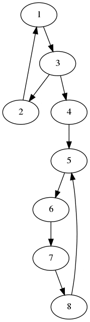
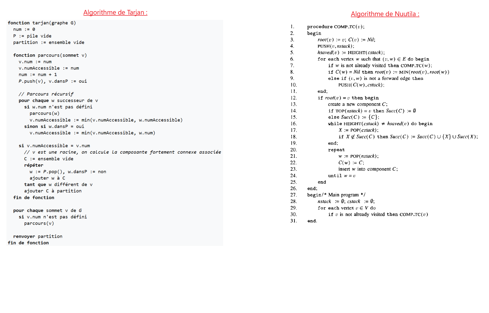

# Algorithmes

## Contenu :
Nous avons étudié la modification de l'algorithme de Tarjan par [Nuutila](Tarjan_Modification_Nuutila.pdf) pour chercher les composantes fortement connexes (SCCs) d'un graphe.

- Les deux versions (récursive et non récursive) sont disponibles dans les fichiers pythons (commentés).

- Le résultat de la version lowlink/preorder en gif (à partir du .dot généré dans le code python) :

- Vous trouverez une version plus explicite en [vidéo](Exemple_Algo_Nuutila.mp4) 

- La comparaison entre les deux algorithmes :

